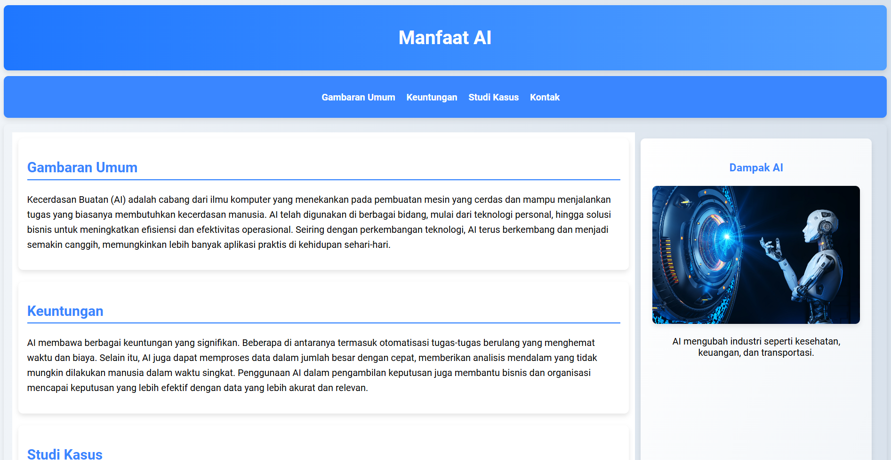

# Manfaat AI

Website ini membahas mengenai manfaat Kecerdasan Buatan (Artificial Intelligence - AI), mulai dari gambaran umum, keuntungan, hingga studi kasus yang relevan. Website ini dibangun menggunakan HTML semantik dan Flexbox untuk tata letak responsif.

## Fitur
- Menggunakan elemen semantik HTML5: `<header>`, `<main>`, `<article>`, `<aside>`, dan `<footer>`.
- Layout menggunakan **Flexbox** untuk mengatur tata letak halaman.
- Navigasi antar bagian konten menggunakan tautan internal yang langsung menuju ke artikel terkait.
- Tema: **Manfaat Kecerdasan Buatan (AI)**, tidak menggunakan tema yang berkaitan dengan Bandung.
- Terdapat gambar relevan dengan konten yang ditampilkan di dalam elemen `<aside>`.
  
## Struktur Halaman

- **Header**: Menampilkan judul utama website.
- **Navigasi**: Menu untuk berpindah ke artikel-artikel seperti Gambaran Umum, Keuntungan, Studi Kasus, dan Kontak.
- **Main Content**: Menampilkan artikel-artikel mengenai AI.
    - **Gambaran Umum**: Penjelasan singkat mengenai apa itu AI.
    - **Keuntungan**: Keuntungan dari penggunaan AI di berbagai bidang.
    - **Studi Kasus**: Contoh penerapan AI di dunia nyata.
    - **Kontak**: Informasi untuk menghubungi.
- **Aside**: Bagian samping yang berisi gambar serta informasi tambahan tentang dampak AI.
- **Footer**: Hak cipta dan informasi tambahan lainnya.

## Tampilan Website

Berikut adalah tampilan halaman utama website:



## Instalasi

Untuk menjalankan proyek ini secara lokal, ikuti langkah-langkah di bawah ini:

1. Clone repositori ini:
   ```bash
   git clone https://github.com/rizkiagungid/Submission-DasarPemprogramanWeb
.
├── assets
│   ├── image
│   │   └── gambar.png    # Gambar yang ditampilkan di <aside>
│   └── style.css         # File CSS untuk styling website
├── index.html            # Halaman utama website
└── README.md             # File README ini

## Teknologi yang Digunakan
HTML5: Untuk struktur semantik halaman.
CSS3: Untuk desain layout menggunakan Flexbox dan styling tambahan seperti gradien dan efek hover.
Google Fonts: Font Roboto diimpor dari Google Fonts untuk tampilan yang lebih modern.